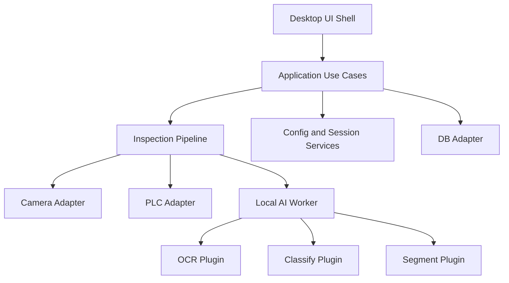

# DRB-OCR-AI-V2

This folder is the scaffold for the next-generation repository.

The target architecture is:
- Modular Monolith Desktop
- Local AI Worker
- Plugin Inspection Pipeline

The design goals are:
- easy desktop deployment
- safe staged updates
- maintainable module boundaries
- clean path to future server-assisted inference
- easy extension to OCR, classify, segment, and future inspection tasks

## Current Milestone

The scaffold is no longer empty. The current V2 slice already includes:
- application contracts and recipe loading
- frame-aware inspection pipeline wiring
- adapter boundaries for camera, PLC, and DB
- OCR plugin helpers for ROI crop/rotate and expected-text matching
- legacy OCR runtime gateway behind a lazy boundary
- login, product catalog sync, product selection, and session settings use cases
- role-based access profile and main-screen context loading
- login/main screen presenters and shell navigation state
- Qt stacked shell with login/main widgets
- runtime mode switch for placeholder camera vs pylon camera
- placeholder classify and segment plugins
- automated checks for contracts, pipeline flow, PLC client, OCR helpers, and cycle execution

## Structure

```text
DRB-OCR-AI-V2/
  docs/
  examples/
  src/drb_inspection/
    app/
    ui/
    application/
    domain/
    adapters/
    workers/
    plugins/
    shared/
  tests/
```

## Intended Runtime Model



## First Migration Rule

Do not move old files blindly.

Migrate in this order:
1. contracts and recipes
2. adapters
3. pipeline orchestration
4. UI shell wiring
5. OCR plugin
6. classify and segment plugins

See:
- [ARCHITECTURE.md](C:/Users/AH/Desktop/DRB-OCR-AI/DRB-OCR-AI-V2/docs/ARCHITECTURE.md)
- [MIGRATION_MAP.md](C:/Users/AH/Desktop/DRB-OCR-AI/DRB-OCR-AI-V2/docs/MIGRATION_MAP.md)
