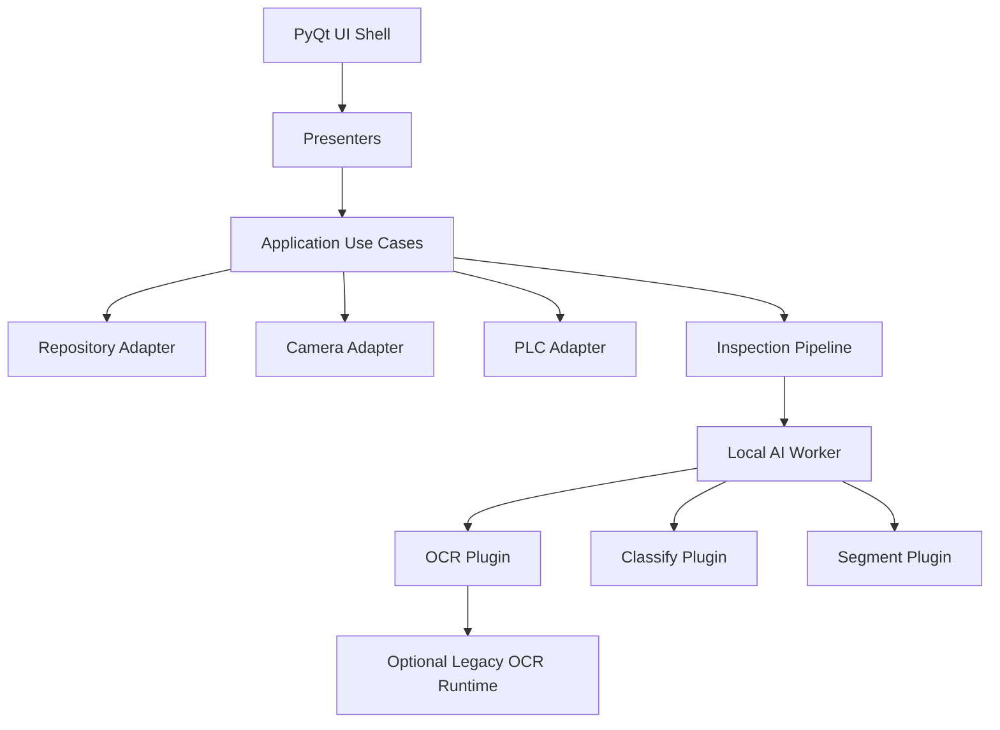
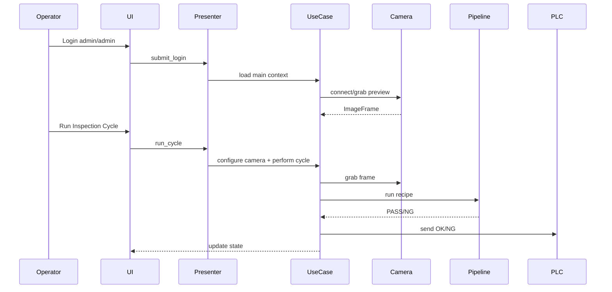

# DRB OCR AI V2

DRB OCR AI V2 là hướng refactor mới của dự án OCR-AI theo mô hình:

- Modular Monolith Desktop
- Local AI Worker
- Plugin Inspection Pipeline

Mục tiêu chính là giữ cách deploy desktop đơn giản, nhưng tách rõ UI, use case, camera, PLC, AI worker và plugin kiểm tra để dễ bảo trì, dễ update, và mở rộng thêm các bài toán như OCR, classify, segment, detect, measure.

## Thông Tin Nhanh

- Runtime chính: Python 3.9+
- UI: PyQt5 desktop
- Package metadata: `pyproject.toml`
- Entry point V2: `src/drb_inspection/app/bootstrap.py`
- VSCode launch config: `DRB V2 Qt Desktop`
- User mặc định: `admin`
- Password mặc định: `admin`
- Case phần cứng hiện tại: Basler camera + Mitsubishi PLC qua SLMP/MC Protocol
- File env local: `.env.v2` ở thư mục `DRB-OCR-AI-V2/`
- File env mẫu: `configs/basler_mitsubishi_slmp.env.example`

Không chạy `main.py` ở repo cũ nếu muốn test V2. `main.py` là entrypoint của bản legacy.

## Trạng Thái Hiện Tại

V2 hiện đã có một vertical slice chạy được:

- Login và phân quyền cơ bản.
- Main screen PyQt cho runtime, preview camera, session settings và inspection cycle.
- Presenter/use case tách khỏi UI.
- Adapter camera đa hãng: demo, Basler, Hikrobot placeholder, Irayple placeholder, OPT placeholder.
- Adapter PLC đa chuẩn: demo, Modbus TCP, Modbus RTU, Mitsubishi SLMP.
- Product/session repository in-memory.
- Plugin pipeline cho OCR, classify, segment.
- OCR plugin có helper crop/rotate ROI, matching expected text và gateway cho legacy runtime.
- Configure camera use case: áp exposure theo product và ROI/image size theo session.
- Auto preview khi login nếu bật `DRB_V2_AUTO_PREVIEW_ON_START=1`.
- Fallback loader trong bootstrap để tự nạp `.env.v2` khi VSCode không inject env.

Đây vẫn là bản refactor/migration, chưa phải bản thay thế hoàn toàn cho legacy production app.

## Kiến Trúc



Nguyên tắc chính:

- `ui/` chỉ render và gọi presenter, không gọi SDK camera/PLC trực tiếp.
- `application/` điều phối use case, không biết chi tiết vendor SDK.
- `adapters/` chứa tích hợp phần cứng và storage.
- `plugins/` chứa logic từng loại kiểm tra.
- `workers/` là biên để sau này đổi từ local inference sang server inference mà không phải viết lại UI.

Tài liệu chi tiết:

- `docs/ARCHITECTURE.md`
- `docs/MIGRATION_MAP.md`

## Cấu Trúc Thư Mục

```text
DRB-OCR-AI-V2/
  configs/
    basler_mitsubishi_slmp.env.example
  docs/
    ARCHITECTURE.md
    MIGRATION_MAP.md
  examples/
    recipes/
      ocr_segment_recipe.yaml
  src/drb_inspection/
    app/
    adapters/
      camera/
      db/
      plc/
    application/
      contracts/
      services/
      use_cases/
    domain/
      inspection/
    plugins/
      classify/
      ocr/
      segment/
    shared/
    ui/
      qt/
      screens/
    workers/
  tests/
```

## Cài Đặt Local

Chạy từ thư mục repo gốc:

```powershell
cd C:\Users\AH\Desktop\DRB-OCR-AI\DRB-OCR-AI-V2
python -m pip install -e .[dev]
```

Nếu test camera Basler thật:

```powershell
python -m pip install pypylon
```

Nếu test PLC Mitsubishi SLMP thật:

```powershell
python -m pip install pymcprotocol
```

Nếu test Modbus TCP/RTU:

```powershell
python -m pip install pymodbus
```

Lưu ý: các dependency phần cứng đang là optional runtime dependency vì mỗi máy triển khai có thể dùng vendor khác nhau.

## Cấu Hình Env

Tạo file local:

```powershell
Copy-Item configs\basler_mitsubishi_slmp.env.example .env.v2
```

Ví dụ profile Basler + Mitsubishi:

```env
DRB_V2_HEADLESS=0
DRB_V2_DEMO_MODE=1
DRB_V2_AUTO_PREVIEW_ON_START=1
DRB_V2_USE_LEGACY_OCR_RUNTIME=0

DRB_V2_CAMERA_VENDOR=basler
DRB_V2_CAMERA_SERIAL=
DRB_V2_CAMERA_IP=
DRB_V2_CAMERA_USER_SET=
DRB_V2_CAMERA_ACQUISITION_MODE=continuous

DRB_V2_PLC_VENDOR=mitsubishi
DRB_V2_PLC_PROTOCOL=slmp
DRB_V2_PLC_IP=192.168.0.250
DRB_V2_PLC_PORT=5000
DRB_V2_PLC_TRIES=1
DRB_V2_PLC_TYPE=Q
DRB_V2_PLC_COMM_TYPE=binary
```

Giải thích quan trọng:

- `DRB_V2_DEMO_MODE=1` chỉ giúp OCR plugin trả expected text trong demo cycle; nó không ép camera thành demo.
- Camera vendor được quyết định bởi `DRB_V2_CAMERA_VENDOR`.
- PLC vendor/protocol được quyết định bởi `DRB_V2_PLC_VENDOR` và `DRB_V2_PLC_PROTOCOL`.
- `.env.v2` bị ignore, không commit lên Git.
- `bootstrap.py` sẽ tự đọc `.env.v2` nếu VSCode không nạp env file.

## Chạy App

Chạy bằng PowerShell:

```powershell
cd C:\Users\AH\Desktop\DRB-OCR-AI\DRB-OCR-AI-V2
python src\drb_inspection\app\bootstrap.py
```

Chạy bằng installed script sau khi `pip install -e .`:

```powershell
drb-v2
```

Chạy trong VSCode:

- Mở Run and Debug.
- Chọn `DRB V2 Qt Desktop`.
- Login bằng `admin` / `admin`.
- Nếu status vẫn hiện `vendor: demo`, nghĩa là đang chạy sai entrypoint hoặc env chưa được nạp. Hãy chạy `DRB-OCR-AI-V2/src/drb_inspection/app/bootstrap.py`.

Chạy headless smoke:

```powershell
$env:DRB_V2_HEADLESS='1'
python src\drb_inspection\app\bootstrap.py
```

Chạy Qt offscreen smoke:

```powershell
$env:DRB_V2_QT_OFFSCREEN='1'
$env:DRB_V2_QT_NO_EXEC='1'
python src\drb_inspection\app\bootstrap.py
```

## Luồng Runtime Chính



## Camera

Camera adapter contract nằm trong:

```text
src/drb_inspection/adapters/camera/
```

Vendor hiện có:

- `demo`: adapter giả, trả `frame://placeholder`.
- `basler`: `PylonCameraAdapter`, dùng `pypylon`.
- `hikrobot`: placeholder cho SDK vendor.
- `irayple`: placeholder cho SDK vendor.
- `opt`: placeholder cho SDK vendor.

Basler adapter hỗ trợ:

- chọn camera theo serial hoặc IP nếu cấu hình;
- auto chọn camera đầu tiên nếu serial/IP để trống;
- grab frame dạng `numpy.ndarray`;
- apply exposure, offset, width, height từ use case.

Nếu UI hiện `Frame source: frame://placeholder`, nghĩa là app đang dùng demo camera hoặc chưa nạp đúng env.

## PLC

PLC adapter contract nằm trong:

```text
src/drb_inspection/adapters/plc/
```

Vendor/protocol hiện có:

- `demo`: adapter giả.
- `mitsubishi + slmp`: Mitsubishi MC Protocol/SLMP qua `pymcprotocol`.
- `generic/siemens/delta + modbus_tcp`: qua `pymodbus`.
- `generic/siemens/delta + modbus_rtu`: qua `pymodbus`.

Signal map mặc định cho Mitsubishi:

```text
M0   grab image
M1   stop machine
M2   start machine
M100 light output
M101 error pulse
```

Các signal map nằm trong:

```text
src/drb_inspection/adapters/plc/profiles.py
```

## Inspection Plugin Pipeline

Recipe định nghĩa các bước kiểm tra:

```yaml
name: ocr-segment-demo
version: 1
steps:
  - step_id: ocr_label
    plugin: ocr
    task_type: ocr
    roi_name: label_roi
    required: true
```

Plugin hiện có:

- `ocr`: kiểm tra chữ/label.
- `classify`: placeholder cho phân loại.
- `segment`: placeholder cho phân vùng/segmentation.

Khi thêm tính năng mới như classify/segment thật:

1. Tạo hoặc mở rộng plugin trong `src/drb_inspection/plugins/<task>/`.
2. Đăng ký plugin trong `PluginRegistry` tại `app/container.py`.
3. Thêm recipe step tương ứng.
4. Thêm test plugin và pipeline.
5. Không gọi model trực tiếp trong UI.

## Test

Chạy test:

```powershell
cd C:\Users\AH\Desktop\DRB-OCR-AI\DRB-OCR-AI-V2
python -m pytest tests -q
```

Chạy test qua VSCode:

- Chọn task `DRB V2 Tests All`, hoặc
- Chọn launch config `DRB V2 Tests All`.

Nếu báo `No module named pytest`:

```powershell
python -m pip install -e .[dev]
```

## Checklist Khi Debug Camera Không Lên

- Đảm bảo chạy entrypoint V2: `src/drb_inspection/app/bootstrap.py`.
- Kiểm tra UI status có hiện `vendor: basler` hay không.
- Nếu vẫn là `demo`, kiểm tra `.env.v2` và `DRB_V2_ENV_FILE`.
- Kiểm tra package `pypylon` đã cài.
- Kiểm tra Basler Pylon Viewer có nhìn thấy camera.
- Nếu dùng GigE camera, kiểm tra IP camera và NIC cùng subnet hoặc để IP trống cho auto discovery.
- Nếu preview summary là `Frame <width>x<height>`, app đã nhận frame thật.
- Nếu preview summary là `frame://placeholder`, app đang dùng demo adapter.

## Checklist Khi Debug PLC

- Kiểm tra `DRB_V2_PLC_VENDOR=mitsubishi`.
- Kiểm tra `DRB_V2_PLC_PROTOCOL=slmp`.
- Kiểm tra IP/port PLC đúng thực tế.
- Với Mitsubishi Q/L/iQ-R thường dùng port SLMP như `5000`, tùy cấu hình PLC.
- Kiểm tra `DRB_V2_PLC_TYPE=Q` hoặc đổi theo dòng PLC nếu cần.
- Kiểm tra `DRB_V2_PLC_COMM_TYPE=binary` hoặc `ascii`.
- Kiểm tra firewall Windows nếu không connect được.
- Kiểm tra signal map trước khi đưa vào máy thật.

## Quy Tắc Phát Triển

Nên làm:

- Thêm use case trước, UI gọi use case sau.
- Giữ SDK camera/PLC trong `adapters/`.
- Giữ AI/model trong `plugins/` hoặc `workers/`.
- Viết test cho contract/use case trước khi nối UI.
- Dùng env profile theo từng máy triển khai.
- Giữ `.env.v2` local, không commit.

Nên tránh:

- Không import SDK camera/PLC trực tiếp trong widget.
- Không để UI tự quyết định PASS/NG.
- Không hardcode IP/port PLC trong source.
- Không đưa model/runtime nặng vào source code nếu chưa có chiến lược artifact.
- Không commit `__pycache__`, `.pyc`, `.env.v2`.
- Không migrate nguyên file legacy vào V2 nếu chưa tách boundary.

## Hướng Deploy Sau Này

V2 được thiết kế để deploy theo desktop installer trước, sau đó có thể nâng cấp dần:

1. Local-only desktop: UI, camera, PLC, AI cùng chạy trên máy line.
2. Hybrid: UI/camera/PLC local, AI worker có thể gọi server inference.
3. Server-assisted: server quản lý recipe/model/log, client desktop chỉ giữ phần realtime gần thiết bị.

Điểm cần giữ ổn định là application contract và plugin pipeline. Khi đó việc đổi local AI worker sang remote worker sẽ ít ảnh hưởng UI.

## Tài Liệu Liên Quan

- `docs/ARCHITECTURE.md`: mô hình kiến trúc chi tiết.
- `docs/MIGRATION_MAP.md`: thứ tự migration từ legacy sang V2.
- `../docs/CI_CD_PLAYBOOK.md`: kinh nghiệm CI/CD từ bản legacy.
