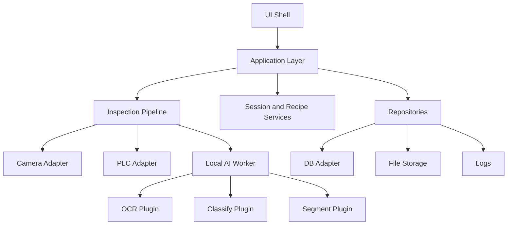
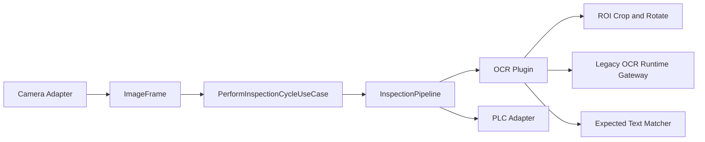

# Architecture

## Core Idea

This repository keeps a single desktop deployment unit, but splits runtime concerns into explicit modules.

That gives us:
- one installer for operators
- clear boundaries for maintenance
- plugin-style inspection growth
- a future path to remote inference without rewriting the UI

## Target Layers



## Module Responsibilities

### `ui/`
- render screens
- dispatch user intent
- subscribe to application events
- never run OCR, PLC polling, or model loading directly
- can use presenters/view-models that only call application use cases
- can expose both headless coordinator mode and Qt widget mode without changing application contracts

### `application/`
- orchestration only
- defines use cases and request/response contracts
- owns no vendor SDK details

### `domain/inspection/`
- inspection recipe model
- step ordering
- result aggregation
- pass/fail decision rules
- frame-aware parameter injection into task requests

### `adapters/`
- hardware and storage boundaries
- camera
- PLC
- DB
- file system
- current production case:
  - camera: Basler through the `pypylon` adapter
  - PLC: Mitsubishi through SLMP/MC Protocol
- adapter structure remains vendor-agnostic so future camera vendors such as Hikrobot, Irayple, and OPT can be implemented behind the same camera contract
- PLC protocol selection is separated from PLC vendor selection, so Siemens/Delta/generic Modbus TCP/RTU and Mitsubishi SLMP can share the same application-level use cases

### `workers/`
- local process or local module boundary for AI execution
- can later be swapped for remote execution

### `plugins/`
- one plugin per algorithm family
- OCR
- classify
- segment
- future tasks such as detect, measure, anomaly

## Current Implemented Slice

The current V2 implementation already validates this flow:



This is still a partial migration, but it proves the target boundaries are workable before the real UI is moved.

It also already proves that legacy screen-driven state can be moved into application use cases:
- login
- product catalog synchronization
- product selection
- session settings load/save
- role-based main-screen access
- cycle execution from the selected product context

## Machine Profile: Basler + Mitsubishi

The active plant case is modeled as:

```text
DRB_V2_CAMERA_VENDOR=basler
DRB_V2_PLC_VENDOR=mitsubishi
DRB_V2_PLC_PROTOCOL=slmp
DRB_V2_PLC_PORT=5000
DRB_V2_PLC_TYPE=Q
DRB_V2_PLC_COMM_TYPE=binary
```

Use `configs/basler_mitsubishi_slmp.env.example` as the baseline profile.

The signal map follows the current legacy convention:
- `M0`: grab image
- `M1`: stop machine
- `M2`: start machine
- `M100`: light output
- `M101`: error pulse

Camera settings are applied through the application layer before preview and inspection:
- exposure comes from the selected product
- ROI/image size comes from the current session settings
- Basler-specific SDK calls stay inside `PylonCameraAdapter`

## Upgrade Path

This design supports three phases:

1. local-only execution
2. hybrid local UI plus remote inference
3. server-assisted orchestration

Only the worker boundary changes between phases. The UI shell and application contracts stay stable.
