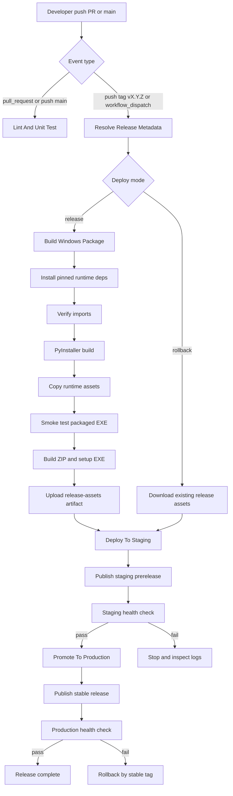
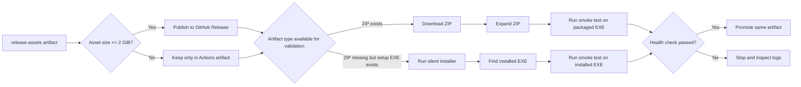

# CI/CD Playbook For Windows Desktop Releases

This document captures the final CI/CD shape used in this repository, the failure patterns we hit while stabilizing it, and a reuse checklist for the next Windows desktop project.

It is written from the experience of shipping this project:
- GitHub Actions
- Windows runner
- Python 3.9
- PyInstaller
- Inno Setup
- GitHub Releases

Use this file as the shortest path to a working pipeline when the next project has the same packaging model.

## 0. AI Execution Contract

This file is intended to be consumed by an AI coding agent, not only by a human developer.

If you are an AI agent working on Windows desktop CI/CD for a similar project, follow these rules exactly:

1. Read this file before changing the workflow, `main.spec`, installer script, or packaging logic.
2. Treat the checklist items in this file as mandatory unless the repository explicitly proves they do not apply.
3. Prefer the existing working pattern in this repository over inventing a new pipeline shape.
4. Make the smallest change that fixes the current root cause.
5. Verify every workflow edit locally before pushing:
   - YAML parse check
   - targeted local syntax check
   - `git diff` review
6. When a release run fails, fix the actual failing step shown in logs. Do not guess three steps ahead.
7. After each CI/CD fix:
   - create one focused commit
   - push to `main`
   - create one new semver tag
   - use that tag to retest full CD
8. Never assume success from installation output alone. Require an import check or smoke test.
9. Never treat GitHub Release as equivalent to Actions artifacts. They have different size limits and different purposes.
10. Do not stop at "build succeeded". The pipeline is only successful when:
   - staging publish succeeds
   - health check succeeds
   - production promotion succeeds
   - production health check succeeds

### AI Goal

The goal is not to make the workflow "look correct".

The goal is to make the following sequence pass on the first serious release attempt:

1. lint
2. unit test
3. package build
4. installer build
5. staging publish
6. staging validation
7. production publish
8. production validation

### AI Working Rules

When using this file, the AI should:

- prefer deterministic, pinned versions over dynamic versions
- prefer explicit imports over assumptions
- prefer explicit path resolution over relative-path luck
- prefer validation from the installed result over validation from build output alone
- prefer built-in GitHub token fallback before requiring PAT secrets
- prefer reusable fixes in workflow, `.spec`, and installer script over one-off workarounds

The AI should avoid:

- changing multiple unrelated parts of the release flow in one commit
- weakening validation just to get a green workflow
- hiding failures behind `continue-on-error: true`
- removing smoke tests to make the pipeline pass
- publishing assets without checking whether users can actually run them
- assuming Windows runner paths are stable across runs

### AI First-Run Order

If starting from scratch on a similar repo, execute work in this order:

1. stabilize local startup logging
2. add smoke-test mode to the app
3. pin dependencies
4. split dev and production dependencies
5. stabilize PyInstaller spec
6. stabilize installer script
7. add CI lint and test
8. add package build
9. add staged release
10. add production promotion
11. add rollback path
12. test with a real release tag

Do not reverse this order unless the repository already has a proven working implementation.

### AI Bootstrap Prompt

If another AI agent needs a short instruction block, use this:

```text
Read docs/CI_CD_PLAYBOOK.md first and follow it as an execution contract.

Your goal is first-pass success for Windows desktop CI/CD:
1. lint
2. unit test
3. PyInstaller package build
4. installer build
5. staging publish
6. staging health check
7. production publish
8. production health check

Rules:
- make the smallest root-cause fix
- verify YAML locally before push
- verify imports before packaging
- do not weaken validation to get green CI
- use built-in github.token fallback unless PAT is strictly needed
- validate installed app behavior, not only build output
- after each fix, create one focused commit and one new semver tag
```

### AI Stop Conditions

The AI should stop and report instead of guessing when:

- the failing log does not show the real root cause
- the repository is missing required runtime assets
- the failure depends on hardware that smoke-test mode cannot bypass
- a secret, environment, or GitHub permission is truly absent
- the next change would require relaxing validation instead of fixing the cause

## 1. Final Pipeline Shape

The release pipeline in [ci-cd-release.yml](C:/Users/AH/Desktop/DRB-OCR-AI/.github/workflows/ci-cd-release.yml) is structured as:

1. `Resolve Release Metadata`
   - decides whether the run is a normal release or rollback
   - normalizes tag names and app version

2. `Lint And Unit Test`
   - installs dev dependencies from [requirements-dev.txt](C:/Users/AH/Desktop/DRB-OCR-AI/requirements-dev.txt)
   - runs `flake8`
   - runs `pytest` with coverage
   - uploads test artifacts

3. `Build Windows Package`
   - installs pinned production and build dependencies
   - builds the PyInstaller bundle from [main.spec](C:/Users/AH/Desktop/DRB-OCR-AI/main.spec)
   - copies runtime assets into the packaged folder
   - runs a smoke test on the packaged executable
   - builds a portable ZIP
   - builds a Windows installer with [DRB-OCR-AI.iss](C:/Users/AH/Desktop/DRB-OCR-AI/installer/DRB-OCR-AI.iss)
   - uploads build logs and release artifacts

4. `Deploy To Staging`
   - publishes a staging prerelease to GitHub
   - validates the staged artifact
   - smoke-tests the app from ZIP when available
   - otherwise installs from setup `.exe` and smoke-tests the installed app

5. `Promote To Production`
   - publishes the validated artifact as the stable release
   - runs a final health check from the production release asset
   - keeps rollback flow available by tag

### Visual Flow



### Release And Artifact Decision Flow



## 2. Files That Matter

- [ci-cd-release.yml](C:/Users/AH/Desktop/DRB-OCR-AI/.github/workflows/ci-cd-release.yml)
  - the real CI/CD source of truth
- [main.spec](C:/Users/AH/Desktop/DRB-OCR-AI/main.spec)
  - PyInstaller collection rules
- [pyinstaller.txt](C:/Users/AH/Desktop/DRB-OCR-AI/pyinstaller.txt)
  - local build reference command
- [DRB-OCR-AI.iss](C:/Users/AH/Desktop/DRB-OCR-AI/installer/DRB-OCR-AI.iss)
  - Windows installer script
- [requirements.txt](C:/Users/AH/Desktop/DRB-OCR-AI/requirements.txt)
  - production dependency base
- [requirements-dev.txt](C:/Users/AH/Desktop/DRB-OCR-AI/requirements-dev.txt)
  - CI lint and test dependencies
- [main.py](C:/Users/AH/Desktop/DRB-OCR-AI/main.py)
  - startup import behavior and smoke-test mode
- [AppLogger.py](C:/Users/AH/Desktop/DRB-OCR-AI/lib/AppLogger.py)
  - startup and crash logging used by smoke tests
- [test_app_logger.py](C:/Users/AH/Desktop/DRB-OCR-AI/tests/test_app_logger.py)
  - Windows-safe regression tests around logging paths

## 3. Hard Lessons From This Project

### 3.1 Never trust a green `pip install` without an import check

Multiple runs looked healthy until the packaged app failed at runtime with:
- `No module named 'PyInstaller'`
- `No module named 'yaml'`
- `No module named 'psutil'`
- `No module named 'torch'`
- `No module named 'ultralytics'`

What worked:
- explicitly install the critical runtime packages in the build job
- immediately follow install with `python -c "import ..."` verification
- fail the job before PyInstaller if an import is missing

Reusable rule:
- every nontrivial packaging workflow should have an `install -> import verify -> build` sequence

### 3.2 PyInstaller needs explicit collection for AI stacks

The app depends on heavy runtime packages:
- `torch`
- `torchvision`
- `torchaudio`
- `ultralytics`
- `cv2`
- `cvzone`
- `pypylon`
- `PIL`

Relying on default PyInstaller discovery was not enough.

What worked:
- use `collect_all(...)` in [main.spec](C:/Users/AH/Desktop/DRB-OCR-AI/main.spec)
- keep [pyinstaller.txt](C:/Users/AH/Desktop/DRB-OCR-AI/pyinstaller.txt) aligned with the same assumptions
- keep startup imports in [main.py](C:/Users/AH/Desktop/DRB-OCR-AI/main.py) honest so the smoke test exercises real runtime loading

Reusable rule:
- if a project ships ML, image, camera, or vendor SDK libraries, assume PyInstaller needs help

### 3.3 Build a smoke test mode into the app early

The first smoke tests hung because startup still touched deep runtime flow and GUI error dialogs.

What worked:
- add `DRB_OCR_AI_SMOKE_TEST=1` behavior in [main.py](C:/Users/AH/Desktop/DRB-OCR-AI/main.py)
- exit before camera, PLC, login flow, and other hardware-bound startup
- write errors to stderr instead of popping blocking dialogs during CI
- collect app logs on failure

Reusable rule:
- add a CI-only startup mode before building the first release pipeline

### 3.4 Windows packaging must be validated from the installed result

Portable ZIP validation alone was not enough. Installer shortcuts and working directory behavior broke on real machines.

What worked:
- resolve resource paths relative to the installed app directory
- set `WorkingDir` in [DRB-OCR-AI.iss](C:/Users/AH/Desktop/DRB-OCR-AI/installer/DRB-OCR-AI.iss)
- add installer validation in staging/production health checks

Reusable rule:
- for desktop apps, validate both:
  - portable execution
  - post-install execution

### 3.5 GitHub Release has a 2 GiB asset limit

This was a real deployment blocker.

Observed failure:
- `Validation Failed`
- `size must be less than 2147483648`

What worked:
- keep full artifacts in Actions artifacts
- publish only release assets below the GitHub Release limit
- if ZIP is too large, publish only the installer and validate from installer

Reusable rule:
- if the app ships large ML weights or runtime bundles, check asset size before calling the release API

### 3.6 Inno Setup on GitHub runners is inconsistent if you hardcode paths

We hit:
- package already installed but wrong version requested
- `ISCC.exe` not found
- runner already had Inno Setup in a different location

What worked:
- resolve `ISCC.exe` by:
  - `Get-Command iscc.exe`
  - standard `Program Files` paths
  - registry uninstall keys
  - `choco install innosetup` only as fallback

Reusable rule:
- do not hardcode installer compiler paths on Windows runners

### 3.7 Use built-in `github.token` unless a PAT is truly needed

We hit:
- `Parameter token or opts.auth is required`

Root cause:
- workflow assumed `GH_RELEASE_TOKEN` was always present

What worked:
- use `${{ secrets.GH_RELEASE_TOKEN || github.token }}`
- keep `permissions: contents: write`

Reusable rule:
- default to built-in GitHub token first, then allow PAT override only when required

### 3.8 Windows tests must defend against odd handler paths

The logger test failed on CI with Windows-only path cases like:
- `\\\\.\\nul`
- `None`

What worked:
- make the test path resolution safe
- avoid assuming every logging handler has a normal filesystem path

Reusable rule:
- if a test inspects Windows paths, guard against special devices and null values

## 4. Error Catalogue From This Project

Use this table as the fastest lookup when a similar pipeline breaks.

| Symptom | Root Cause | Fix Pattern |
| --- | --- | --- |
| `No module named 'PyInstaller'` | build dependency not installed in runner | explicitly install and verify PyInstaller |
| `No module named 'platform'`, `yaml`, `psutil` | missing stdlib or runtime package in bundle | add explicit import verification and PyInstaller collection |
| `No module named 'torch'` | torch not installed or not collected | pin torch install and use `collect_all` |
| `No module named 'ultralytics'` | package absent from build environment | install package explicitly before build |
| `pkg_resources` missing | `setuptools` not available at build time | install or upgrade `setuptools` before PyInstaller |
| `ISCC.exe was not found` | Inno Setup path detection too narrow | resolve via command, filesystem, registry, then fallback install |
| `Parameter token or opts.auth is required` | release token empty | fallback to `github.token` |
| `size must be less than 2147483648` | release asset exceeds GitHub limit | skip oversized asset for release upload |
| shortcut created but app does not open | working directory and relative paths broken after install | resolve resources from app root and set shortcut `WorkingDir` |
| smoke test hangs | GUI popup or hardware startup blocks CI | CI-only mode, stderr logging, timeout and process kill |

## 5. Reuse Checklist For The Next Project

Copy this checklist before writing the next Windows desktop CI/CD pipeline.

## 5A. What To Do From Day One

If the goal is to get the pipeline working on the first serious release attempt, do these things early and do not postpone them:

- pin the exact Python version and critical build tool versions
- separate `requirements.txt` and `requirements-dev.txt`
- keep a maintained `.spec` file instead of building only from a raw CLI command
- add a smoke-test mode inside the app before writing the workflow
- make the app log startup failures to files and stderr
- resolve runtime files from the installed app directory, not from the current working directory
- verify imports for heavy packages before calling PyInstaller
- upload logs and test reports on every failure path
- validate the actual delivery format users will run
- assume GitHub Release asset limits will matter if the app ships models or large runtimes

## 5B. What To Avoid

These are the habits that caused real time loss in this project and should be treated as red flags:

- do not assume `pip install` succeeded just because the command ended green
- do not assume PyInstaller will discover AI, vision, or vendor SDK packages by itself
- do not hardcode paths to `ISCC.exe`, models, UI files, or Excel/runtime assets
- do not validate only the portable ZIP if users mainly install through `setup.exe`
- do not rely on GUI popups for error visibility in CI
- do not make release publication depend only on a manually created PAT if `github.token` is enough
- do not publish large assets to GitHub Release without checking their size first
- do not let rollback depend on rebuilding the current source
- do not write Windows path assertions in tests without handling `None`, device paths, and odd handlers
- do not ship a shortcut whose working directory is left implicit

## 5C. First-Pass Success Checklist

Use this exact checklist before pushing the first release tag.

### Application Readiness

- [ ] `main.py` supports a CI smoke-test mode that exits before hardware access
- [ ] startup failures are written to `stderr` and to a log file
- [ ] resource paths resolve from app root or install root
- [ ] the installer sets the shortcut working directory
- [ ] the app can start without camera, PLC, DB, or dongle in CI mode

### Dependency Readiness

- [ ] `requirements.txt` is pinned
- [ ] `requirements-dev.txt` is pinned
- [ ] the workflow installs build tools explicitly
- [ ] the workflow runs `python -c "import ..."` checks for heavy runtime packages
- [ ] PyInstaller collection rules for AI/vision/vendor packages are kept in `main.spec`

### Workflow Readiness

- [ ] the workflow uses pinned action versions such as `actions/checkout@v4`
- [ ] each job has `timeout-minutes`
- [ ] test reports are uploaded with `if: always()`
- [ ] failure notification steps use `if: failure()`
- [ ] release jobs have `permissions: contents: write`
- [ ] release token logic falls back to `github.token`

### Packaging Readiness

- [ ] PyInstaller output is smoke-tested before release publication
- [ ] non-Python runtime assets are copied after the bundle is built
- [ ] installer build resolves `ISCC.exe` dynamically
- [ ] the ZIP size is checked against the GitHub Release asset limit
- [ ] the workflow can still publish the installer if the ZIP is too large

### Deployment Readiness

- [ ] the pipeline publishes to staging before production
- [ ] staging runs a real health check on the delivered artifact
- [ ] production promotes the same artifact that passed staging
- [ ] rollback can re-promote an old good tag without rebuild
- [ ] the release artifact users download is clearly identified as the installer `.exe`

### Local Preflight Before Tagging

- [ ] `python -m py_compile main.py`
- [ ] `pytest tests`
- [ ] `pyinstaller --clean --noconfirm main.spec`
- [ ] installer build works locally or at least path resolution is verified
- [ ] the packaged app starts in smoke-test mode locally
- [ ] `git status` contains only intended changes
- [ ] the release tag has not been used before

### Final Go / No-Go Rule

Do not push the first release tag until all of the following are true:

- [ ] CI lint is green
- [ ] CI unit tests are green
- [ ] local smoke-test start is green
- [ ] PyInstaller build is green
- [ ] installer path resolution is green
- [ ] release asset size is understood
- [ ] staging token/auth path is understood
- [ ] rollback path is defined

### Before CI/CD

- split `requirements.txt` and `requirements-dev.txt`
- pin Python version
- pin build tools such as `pyinstaller` and `pyinstaller-hooks-contrib`
- create an app-level smoke test mode
- add startup logging and crash logging
- ensure resource paths work when installed under `Program Files`
- make installer shortcuts set the correct working directory

### CI Stage

- cache `pip`
- run lint first
- run unit tests with coverage
- upload test reports even on failure
- add explicit import verification for heavy runtime packages

### Build Stage

- install production dependencies explicitly
- verify imports explicitly
- build with PyInstaller from a maintained `.spec`
- copy non-Python runtime assets after build
- run packaged smoke test with timeout
- upload build logs

### Release Stage

- use `permissions: contents: write`
- use built-in `github.token` by default
- publish staging first
- validate the staged artifact before production
- filter out assets larger than the GitHub Release limit
- always keep Actions artifacts even when Release assets are filtered

### Installer Stage

- resolve installer compiler path dynamically
- do not assume a specific Inno Setup version already installed on runner
- support silent install in validation steps
- smoke-test the installed executable, not just the raw installer exit code

### Rollback Stage

- allow rerunning pipeline with a stable tag
- re-promote a known-good release without rebuilding
- never make rollback depend on the current source tree

## 6. Suggested Template For Similar Projects

If the next project is another Windows desktop app with hardware or AI dependencies, keep this shape:

1. `lint-and-test`
2. `build-package`
3. `deploy-staging`
4. `deploy-production`
5. `rollback` via manual dispatch

And keep these design rules:
- build once, promote the same artifact
- collect runtime logs during packaging and health checks
- fail fast on missing imports
- validate the same installation mode users will run
- treat GitHub Release size limits as a first-class design constraint

## 7. Project-Specific Notes For DRB-OCR-AI

These points are specific to this repository and may not carry over directly:
- the package contains heavy OCR and vision dependencies, which increase artifact size
- runtime assets include UI files, icons, model files, vendor SDK-adjacent libraries, and OCR runtime folders
- the project benefits from both portable and installer validation because the installed shortcut behavior matters
- some runtime dependencies are hardware-related and cannot be fully exercised in CI, so smoke test mode must stop before real device access

## 8. Fast Start For The Next Repo

If you want to move fast on the next project, copy these files first:
- [ci-cd-release.yml](C:/Users/AH/Desktop/DRB-OCR-AI/.github/workflows/ci-cd-release.yml)
- [main.spec](C:/Users/AH/Desktop/DRB-OCR-AI/main.spec)
- [pyinstaller.txt](C:/Users/AH/Desktop/DRB-OCR-AI/pyinstaller.txt)
- [DRB-OCR-AI.iss](C:/Users/AH/Desktop/DRB-OCR-AI/installer/DRB-OCR-AI.iss)
- [requirements-dev.txt](C:/Users/AH/Desktop/DRB-OCR-AI/requirements-dev.txt)

Then immediately adapt:
- Python version
- package list
- app executable name
- smoke-test env var name
- runtime asset directories
- installer product metadata
- release asset size strategy

That order is the shortest path to a repeatable Windows desktop CI/CD pipeline.
